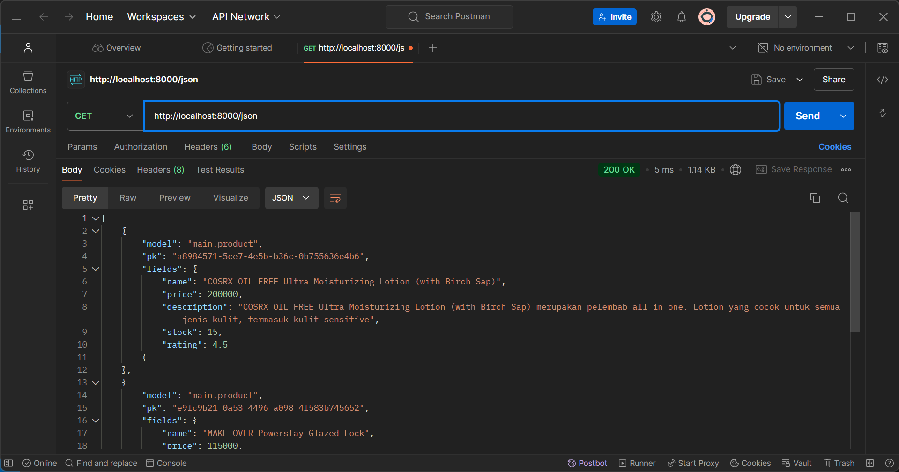
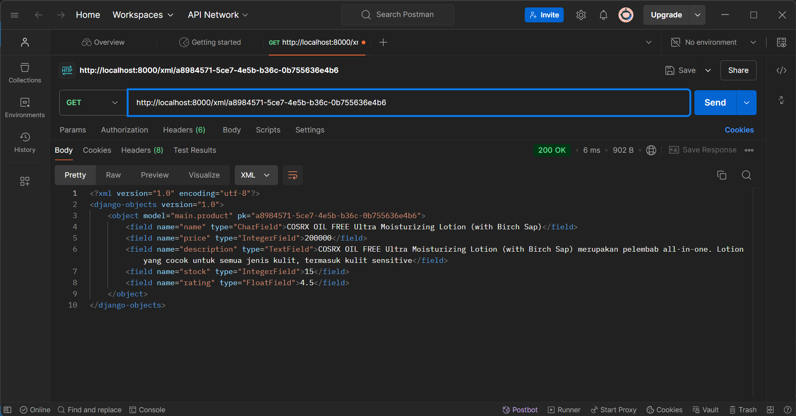

**Nama   : Anggun Sasmitha Dewi**

**NPM    : 2306165673** 

**Kelas  : PBP A**

# 🔗[Link to Fresh and Bloom!🌿](http://anggun-sasmitha-eshoppbp.pbp.cs.ui.ac.id/)


<details>
    <summary><strong>📘Tugas 2 PBP</strong></summary>

### Jelaskan bagaimana cara kamu mengimplementasikan checklist di atas secara step-by-step (bukan hanya sekadar mengikuti tutorial)
#### A. Membuat sebuah proyek Django baru
 - Membuat direktori baru pada komputer
 - Membuat repositori baru pada github
 - Menghubungkan direktori komputer dengan repositori di github
 - Menginstall django dengan membuat virtual environment melalui perintah `python -m venv env`
 - Mengaktifkan virtual environment Windows dengan perintah `env\Scripts\activate`
 - Membuat berkas `requirements.txt` untuk menambahkan beberapa dependencies
 - Melakukan instalasi terhadap dependencies yang ada dengan perintah `pip install -r requirements.txt`
 - Membuat proyek django dengan perintah `django-admin startproject eshop .`
 - Memastikan bahwa berkas `manage.py` aktif dengan perintah `python manage.py runserver`

#### B. Membuat aplikasi dengan nama main pada proyek
 - Menjalankan perintah `python manage.py startapp main`
 untuk membuat aplikasi baru dengan nama main
 - Mendaftarkan aplikasi main ke dalam proyek dengan menambahkan `'main'` ke dalam variabel INSTALLED_APPS yang ada pada `settings.py` di dalam direktori proyek eshop

#### C. Melakukan routing pada proyek agar dapat menjalankan aplikasi main
 - Melakukan konfigurasi routing URL dengan membuat berkas `urls.py` di dalam direktori main, kemudian menambahkan perintah dalam urls.py dalam direktori main yang berisi:
    ```
    from django.urls import path
    from main.views import show_main
    app_name = 'main'
    urlpatterns = [
        path('', show_main, name='show_main'),
        ]
    ```
 - Membuka berkas `urls.py` dalam direktori proyek eshop kemudian mengimpor fungsi
`from django.urls import path, include`
 - Menambah perintah berikut untuk mengarahkan ke tampilan main:
    ```
    urlpatterns = [
        path('', include('main.urls')),
    ]
    ```

#### D. Membuat model pada aplikasi main dengan berkas models.py dan menambahkan perintah:
 - Menambahkan perintah mada berkas models.py dengan:
    ```
    from django.db import models
    class Product(models.Model):
        by = models.CharField(max_length=255)
        kelas = models.CharField(max_length=255)
        name = models.CharField(max_length=255)
        price = models.IntegerField()
        description = models.TextField()
        stock = models.IntegerField()
        rating = models.FloatField()

        def name_of_product(self):
            return self.name
        
        def is_available(self):
            return self.stock > 0
        
        def is_good(self):
            return self.rating > 3
    ```

#### E. Membuat sebuah fungsi pada views.py untuk dikembalikan ke dalam sebuah template HTML
 - Membuat sebuah fungsi pada views.py yang berisi perintah:
    ```
    from django.shortcuts import render
    from .models import Product

    def show_main(request):
        context = {
            'by' : 'Anggun Sasmitha Dewi',
            'kelas' : 'PBP A',
            'name' : 'Moisturizer COSRX',
            'price': '200000',
            'description': 'COSRX OIL FREE Ultra Moisturizing Lotion (with Birch Sap) merupakan pelembab all-in-one. Lotion yang cocok untuk semua jenis kulit, termasuk kulit sensitive',
            'stock': '10',
            'rating': '4.3',
        }

        return render(request, "main.html", context)
    ```

#### F. Membuat sebuah routing pada urls.py aplikasi main untuk memetakan fungsi yang telah dibuat pada views.py
 - Menambahkan perintah pada berkas urls.py pada direktori main yang berisi:
    ```
    from django.urls import path
    from main.views import show_main

    app_name = 'main'

    urlpatterns = [
        path('', show_main, name='show_main'),
    ]
    ```

#### G. Melakukan deployment ke PWS terhadap aplikasi yang sudah dibuat
 - Membuat proyek baru dengan menekan tombol `Create New Project`
 - Pada berkas `settings.py`, menambahkan URL PWS pribadi ke dalam ALLOWED_HOSTS
 - Menjalankan perintah `git branch -M main`
 - Menjalankan perintah `git push pws main:master` untuk selanjutnya


### Buatlah bagan yang berisi request client ke web aplikasi berbasis Django beserta responnya dan jelaskan pada bagan tersebut kaitan antara urls.py, views.py, models.py, dan berkas html.

Alur program:
- Klien mengirimkan permintaan melalui internet dan diterima oleh urls.py
- Django memeriksa urls.py untuk menentukan view mana yang harus memproses permintaan tersebut
- View di views.py memproses permintaan dengan membaca atau menulis data melalui model di models.py
- View kemudian menggunakan template HTML untuk merender halaman web
- Django mengirimkan respons dalam bentuk halaman HTML ke klien melalui internet


### Jelaskan fungsi git dalam pengembangan perangkat lunak!
Git merupakan sebuah sistem kontrol yang membantu programmer dalam berkolaborasi secara tim. Dengan git, programmer dapat melacak perubahan dan memantau semua revisi yang telah dilakukan pada program.

### Menurut Anda, dari semua framework yang ada, mengapa framework Django dijadikan permulaan pembelajaran pengembangan perangkat lunak?
Menurut saya, django sering dijadikan permulaan dalam pembelajaran pengembangan perangkat lunak karena django merupakan full-stack framework, yang berarti mencakup semua aspek pengembangan aplikasi web, mulai dari database, pengelolaan URL, hingga pengiriman template ke front-end.
Django terkenal dengan filosofi "batteries included," yang berarti framework ini dilengkapi dengan berbagai fitur bawaan yang berguna, seperti otentikasi, ORM (Object-Relational Mapping), dan admin interface. Selain itu, django memiliki dokumentasi yang sangat lengkap dan terstruktur, sehingga lebih mudah dipelajari oleh pemula Django juga sangat kuat dan fleksibel. Pemula bisa mulai dengan aplikasi sederhana dan kemudian memperluasnya seiring dengan meningkatnya pengetahuan mereka. 

### Mengapa model pada Django disebut sebagai ORM?
Model pada Django disebut sebagai ORM (Object-Relational Mapping) karena berfungsi sebagai penghubung antara database relasional dan kode Python. ORM memungkinkan programmer untuk bekerja dengan database menggunakan objek-objek Python dibanding menulis kode SQL secara langsung.
</details>

<details>
    <summary><strong>📘Tugas 3 PBP</strong></summary>

### Jelaskan mengapa kita memerlukan data delivery dalam pengimplementasian sebuah platform?
Kita memerlukan data delivery dalam pengimplementasian sebuah platform karena data delivery membantu developer dalam mengirimkan data secara cepat dan efisien. Data delivery juga memastikan bahwa data yang berada pada aplikasi frontend, server, maupun database tetap sinkron. Pada tugas kali ini, kita membutuhkan data delivery karena e-commerce membutuhkan pengiriman data secara cepat dan tepat waktu agar pengguna dapat berinteraksi dengan platform secara real-time tanpa adanya delay.

### Menurutmu, mana yang lebih baik antara XML dan JSON? Mengapa JSON lebih populer dibandingkan XML?
Sebelum masuk ke jawaban, saya akan menjelaskan perbedaan antara JSON dan XML terlebih dahulu. Dilansir dari aws.amazon.com, perbedaan keduanya dapat dilihat pada tabel berikut:
| **Keterangan**          | **JSON**                                                                 | **XML**                                                                                     |
|------------------------|-------------------------------------------------------------------------|---------------------------------------------------------------------------------------------|
| **Format**              | Menggunakan struktur mirip peta dengan pasangan key-value.                     | Menyimpan data dalam struktur pohon dengan namespace untuk kategori data yang berbeda.           |
| **Syntax**              | Sintaks JSON lebih ringkas dan lebih mudah dibaca dan ditulis.        | Sintaks XML menggantikan beberapa karakter dengan referensi entitas, menjadikannya lebih verbose. |
| **Parsing**             | Dapat parsing JSON dengan JSON dengan fungsi JavaScript standar.                 | Perlu parsing menggunakan parser XML.                                                   |
| **Dokumentasi**| Ssederhana dan lebih fleksibel.                                       | Kompleks dan kurang fleksibel.                                                           |
| **Tipe Data**          | Mendukung angka, objek, string, dan array Boolean.            | Mendukung semua tipe data JSON dan tipe tambahan seperti Boolean, tanggal, gambar, dan namespace. |
| **Kemudahan Penggunaan**         | Memiliki ukuran file yang lebih kecil dan transmisi data yang lebih cepat.               | Struktur tag XML lebih kompleks untuk ditulis dan dibaca, serta menghasilkan file yang lebih besar.              |
| **Keamanan**            | Lebih aman dibanding XML.                                                 | Harus mematikan DTD ketika bekerja dengan XML untuk mengurangi risiko kurangnya keamanan.          |

Dari tabel tersebut, dapat disimpulkan bahwa JSON ebih baik dalam data delivery. Struktur JSON dibuat sederhana, mirip seperti struktur dictionary pada Python yang memiliki pasangan key-value. Pembacaan JSON lebih mudah dilakukan dibanding XML yang mengharuskan adanya elemen-elemen dengan tag pembuka dan penutup (seperti HTML). Selain itu, JSON dirancang untuk berfungsi langsung dengan JavaScript, di mana JavaScript dapat langsung memproses dan mengubah JSON menjadi objek tanpa memerlukan parsing yang kompleks. 
Hal itulah yang menurut saya menjadi alasan juga mengapa JSON lebih populer dibanding XML. JSON lebih mudah dibaca karena formatnya lebih ringkas (tidak memerlukan tag pembuka dan penutup seperti XML). Oleh karena itu, JSON sering digunakan karena memiliki banyak keuntungan yang memudahkan para developer untuk mengembangkan suatu web modern.

### Jelaskan fungsi dari method is_valid() pada form Django dan mengapa kita membutuhkan method tersebut?
Fungsi dari method is_valid() pada form Django adalah untuk melakukan validasi terhadap data yang dikirimkan oleh user melalui form. Method ini memeriksa apakah data yang dimasukkan oleh user sesuai dengan aturan yang ditentukan dalam form tersebut, seperti jenis data, panjang teks, atau format tertentu. Method ini akan mengembalikan nilai True apabila data yang dimasukkan oleh user sudah valid dengan ketentuan, dan mengembalikan False apabila tidak valid. 

### Mengapa kita membutuhkan csrf_token saat membuat form di Django? Apa yang dapat terjadi jika kita tidak menambahkan csrf_token pada form Django? Bagaimana hal tersebut dapat dimanfaatkan oleh penyerang?
Kita membutuhkan csrf_token (Cross-Site Request Forgery token) saat membuat form di Django untuk melindungi web dari serangan CSRF, yaitu ketika penyerang mencoba membuat pengguna tanpa disadari melakukan permintaan tidak sah ke server. 
Setiap kali sebuah form di-submit, Django memeriksa apakah ada csrf_token yang valid dan cocok dengan token yang telah di-authorize pengguna. Jika kita tidak menambahkan csrf_token dalam form Django, web menjadi rentan terhadap serangan CSRF. Dalam serangan ini, penyerang dapat memanipulasi user dengan mengirimkan request palsu ke server dari situs web yang telah di-authorize oleh user. 
Dengan dikirimkannya request palsu, penyerang dapat memanfaatkan kesempatan ini untuk mengeksekusi tindakan yang tidak diinginkan user, seperti mengubah atau menghapus data. Selain itu, penyerang dapat mengirim permintaan ke server dengan kredensial user tanpa sepengetahuan oleh user. 

### Jelaskan bagaimana cara kamu mengimplementasikan checklist di atas secara step-by-step (bukan hanya sekadar mengikuti tutorial)
 - Membuat berkas baru dengan nama `base.html` yang berada pada folder baru bernama `templates` yang ditaruh pada direktori utama.
 - Menambahkan perintah berikut pada `base.html`:
    ```
    
    <!DOCTYPE html>
    <html lang="en">
    <head>
        <meta charset="UTF-8" />
        <meta name="viewport" content="width=device-width, initial-scale=1.0" />
         
    </head>

    <body>
         
    </body>
    </html>
    ```
 - Membuka settings.py dan menambahkan perintah berikut pada baris `TEMPLATES`  `:
    ```
    TEMPLATES = [
        {
            'BACKEND': 'django.template.backends.django.DjangoTemplates',
            'DIRS': [BASE_DIR / 'templates'], # Tambahkan konten baris ini
            'APP_DIRS': True,
            ...
        }
    ]
    ```
 - Mengubah isi dari berkas `main.html` menjadi:
    ```
    
    
    <h1>Shop at Fresh n Bloom</h1>

    
    <p>Belum ada data product pada Fresh n Bloom.</p>
    
    <table>
    <tr>
        <th>Product Name</th>
        <th>Price</th>
        <th>Description</th>
        <th>Stock</th>
        <th>Rating</th>
    </tr>

     Berikut cara memperlihatkan data product di bawah baris ini 
     
    
    <tr>
        <td>{{product_entry.name}}</td>
        <td>{{product_entry.price}}</td>
        <td>{{product_entry.description}}</td>
        <td>{{product_entry.stock}}</td>
        <td>{{product_entry.rating}}</td>
    </tr>
    
    </table>
    

    <br />

    <a href="">
    <button>Add New Product</button>
    </a>
    
    ```
 - Menambahkan potongan kode berikut pada berkas `models.py`
    ```
    import uuid
    from django.db import models

    class Product(models.Model):
        id = models.UUIDField(primary_key=True, default=uuid.uuid4, editable=False)
        name = models.CharField(max_length=255)
        price = models.IntegerField()
        description = models.TextField()
        stock = models.IntegerField()
        rating = models.FloatField()

        def name_of_product(self):
            return self.name
        
        def is_available(self):
            return self.stock > 0
        
        def is_good(self):
            return self.rating > 3
    ```
 - Melakukan migrasi model dengan perintah:
    ```
    python manage.py makemigrations
    python manage.py migrate
    ```
 - Membuat berkas baru pada direktori `main` dengan nama `forms.py`
 - Menambahkan kode pada berkas `forms.py` yang berisi:
    ```
    from django.forms import ModelForm
    from main.models import Product

    class ProductForm(ModelForm):
        class Meta:
            model = Product
            fields = ["name", "price", "description", "stock", "rating"]
    ```
 - Membuka berkas `views.py` yang ada dalam direktori main dan menambahkan kode:
    ```
    from django.shortcuts import render, redirect
    from main.models import Product
    from main.forms import ProductForm
    from django.http import HttpResponse
    from django.core import serializers

    def show_main(request):
        product_entries = Product.objects.all()
        
        context = {
            'by' : 'Anggun Sasmitha Dewi',
            'kelas' : 'PBP A',
            'product_entries' : product_entries
        }

        return render(request, "main.html", context)

    def create_product(request):
        form = ProductForm(request.POST or None)

        if form.is_valid() and request.method == "POST":
            form.save()
            return redirect('main:show_main')

        context = {'form': form}
        return render(request, "create_product.html", context)

    def show_xml(request):
        data = Product.objects.all()
        return HttpResponse(serializers.serialize("xml", data), content_type="application/xml")

    def show_json(request):
        data = Product.objects.all()
        return HttpResponse(serializers.serialize("json", data), content_type="application/json")

    def show_xml_by_id(request, id):
        data = Product.objects.filter(pk=id)
        return HttpResponse(serializers.serialize("xml", data), content_type="application/xml")

    def show_json_by_id(request, id):
        data = Product.objects.filter(pk=id)
        return HttpResponse(serializers.serialize("json", data), content_type="application/json")
    ```

 - Membuat routing URL untuk masing-masing views dengan membuka urls.py pada direktori main dan mengimport fungsi `create_product`, `show_xml`, `show_json`, `show_xml_by_id`, `show_json_by_id` serta menambahkan kode:
    ```
    urlpatterns = [
        path('', show_main, name='show_main'),
        path('create-product', create_product, name='create_product'),
        path('xml/', show_xml, name='show_xml'),
        path('json/', show_json, name='show_json'),
        path('xml/<str:id>/', show_xml_by_id, name='show_xml_by_id'),
        path('json/<str:id>/', show_json_by_id, name='show_json_by_id'),
    ]
    ```
- Membuat berkas HTML baru dengan nama `create_product.html` dan menambahkan kode:
    ```
     
    
    <h1>Add Product</h1>

    <form method="POST">
    
    <table>
        {{ form.as_table }}
        <tr>
        <td></td>
        <td>
            <input type="submit" value="Add Product" />
        </td>
        </tr>
    </table>
    </form>

    
    ```

- Menambahkan kode pada berkas `main.py` yang berisi:
    ```
    
    
    <h1>Shop at Beyoutiful</h1>

    
    <p>Belum ada data product pada Beyoutiful.</p>
    
    <table>
    <tr>
        <th>Product Name</th>
        <th>Price</th>
        <th>Description</th>
        <th>Stock</th>
        <th>Rating</th>
    </tr>

     Berikut cara memperlihatkan data product di bawah baris ini 
     
    
    <tr>
        <td>{{product_entry.name}}</td>
        <td>{{product_entry.price}}</td>
        <td>{{product_entry.description}}</td>
        <td>{{product_entry.stock}}</td>
        <td>{{product_entry.rating}}</td>
    </tr>
    
    </table>
    

    <br />

    <a href="">
    <button>Add New Product</button>
    </a>
    
    ```

### Screenshot hasil Postman
 - XML
 
 - JSON
 
 - XML by ID
 
 - JSON by ID
 

## Referensi
Amazon Web Services. (n.d.). The difference between JSON and XML. Amazon Web Services. Retrieved September 16, 2024, from https://aws.amazon.com/compare/the-difference-between-json-xml/#:~:text=JSON%20is%20generally%20a%20better,structures%20that%20require%20data%20exchange.
</details>

<details>
    <summary><strong>📘Tugas 4 PBP</strong></summary>

### Apa perbedaan antara HttpResponseRedirect() dan redirect()
Dilansir dari stackoverflow.com, argumen pertama HttpResponseRedirect() hanya menerima bentuk URL sebagai string, sedangkan redirect() menerima bentuk model, nama view, maupun URL dalam argumennya. Hal ini menjadi keuntungan dari redirect() itu sendiri, yakni untuk mengurangi hardcoding URL, sehingga lebih mudah untuk memelihara aplikasi jika ada perubahan pada URLconf, sedangkan HttpResponseRedirect() kurang fleksibel dalam hal resolusi URL dinamis.

### Jelaskan cara kerja penghubungan model Product dengan User!
Cara kerja penghubungan model Product dengan User dilakukan menggunakan `ForeignKey`. ForeignKey digunakan untuk mendefinisikan many-to-one relationship, dalam hal ini adalah model Product dengan model User. Perintah ForeignKey ditambahkan pada berkas `models.py` dengan perintah:
```
class Product(models.Model):
    user = models.ForeignKey(User, on_delete=models.CASCADE)
```

### Apa perbedaan antara authentication dan authorization, apakah yang dilakukan saat pengguna login? Jelaskan bagaimana Django mengimplementasikan kedua konsep tersebut
Dilansir dari ruangdeveloper.com, perbedaan antara authentication dengan authorization dapat dilihat pada tabel berikut:
| **Authentication** | **Authorization** |
|--------------------|-------------------|
| Proses menentukan identitas pengguna | Proses untuk menentukan apakah pengguna memiliki akses ke sumber daya |
| Bekerja menggunakan kata sandi, OTP, informasi biometrik, dan informasi lain yang diberikan atau dimasukkan oleh pengguna | Bekerja berdasarkan peraturan yang telah ditetapkan oleh developer atau organisasi pemilik aplikasi |
| Tahap pertama dalam proses pemeriksaan keamanan | Selalu dijalankan setelah proses authentication selesai |
| Terlihat dan sebagian dapat diubah oleh pengguna | Tidak terlihat dan tidak dapat diubah oleh pengguna |
| "Siapa kamu?" | "Apa yang bisa dilakukan?" |

Django mengimplementasikan authentication dan authorization dengan menggunakan modul `django.contrib.auth`. Saat user mencoba login dengan memasukkan data, Django akan memverifikasi data yang dimasukkan user dengan data yang ada dalam database. Django menggunakan model `User` bawaan untuk menyimpan informasi ini. Jika data yang dimasukkan cocok, sistem mengautentikasi pengguna dan membuat session menggunakan middleware session. Session ini memungkinkan user tetap login tanpa harus memasukkan kredensial berulang kali pada setiap permintaan. Setelah itu, user akan melalui proses authorization. Implementasi authorization dalam Django melibatkan penggunaan dekorator `@login_required` yang ditambahkan pada berkas `views.py` untuk memastikan bahwa hanya user yang telah login yang dapat mengakses suatu halaman.

Contoh penerapannya saat menggunakan website SCELE. User melewatkan proses authentication terlebih dahulu dengan melakukan login untuk menentukan apakah terdaftar sebagai civitas UI atau bukan. Setelah berhasil dalam authentication, sistem SCELE akan menentukan apa saja yang bisa diakses dan dlakukan oleh user tersebut, di mana terdapat perbedaan kendali antara dosen dengan mahasiswa. Inilah yang disebut dengan proses authorization.

### Bagaimana Django mengingat pengguna yang telah login? Jelaskan kegunaan lain dari cookies dan apakah semua cookies aman digunakan?
Django mengingat pengguna yang telah melakukan login dengan menggunakan session. Saat pengguna berhasil melakukan login, Django membuat session unik untuk pengguna tersebut dan menyimpan data session di sisi server. Kemudian, Django mengirimkan cookies ke browser pengguna, yang biasanya disebut `sessionid`. Cookie ini berisi session ID yang digunakan untuk mengaitkan request selanjutnya dari pengguna dengan data session yang tersimpan di server. Setiap kali pengguna membuat request baru, browser mengirimkan cookie sessionid secara otomatis.

Dilansir dari blog.sucuri.net, penggunaan cookies relatif aman digunakan. Data di dalam cookies tidak berbahaya Namun, jika data cookie jatuh ke tangan yang salah, maka dapat disalahgunakan untuk mengakses browsing sessions, informasi pribadi, dan lainnya. Menurut identitiy managementinstitute.org, beberapa kemungkinan serangan ketika menggunakan cookies, yakni:
1. Session Hijacking: Penyerang dapat menggunakan cookie sesi yang dicuri untuk berpura-pura menjadi pengguna yang sah dan mengakses akun mereka. Dengan mencuri cookie sesi, penyerang dapat melewati mekanisme autentikasi dan melakukan tindakan atas nama korban, seperti mengirim pesan, melakukan pembelian, atau mengakses informasi sensitif.
2. Cross-Site Scripting (XSS): Serangan XSS dapat menyisipkan kode berbahaya ke dalam situs web, yang kemudian bisa digunakan untuk mengatur atau menyalahgunakan cookie di browser pengguna. Cookie berbahaya ini bisa digunakan untuk mencuri data pribadi, seperti informasi login atau token sesi saat pengguna berinteraksi dengan situs web yang sudah terinfeksi.
3. Cross-Site Request Forgery (CSRF): Serangan CSRF memanfaatkan hubungan kepercayaan antara situs web dan browser untuk menjalankan tindakan tanpa izin atas nama pengguna. Penyerang dapat menggunakan cookie untuk memalsukan permintaan HTTP yang tampak berasal dari browser pengguna, sehingga mereka bisa melakukan tindakan seperti mentransfer dana, mengubah pengaturan akun, atau mengirim formulir tanpa persetujuan pengguna.
4. Tracking dan Profiling: Meskipun tidak selalu berbahaya secara langsung, cookie dapat digunakan oleh pengiklan dan broker data untuk melacak perilaku online pengguna dan membangun profil rinci tentang minat, preferensi, serta kebiasaan mereka. Informasi ini bisa dimanfaatkan untuk menargetkan iklan, melakukan penipuan identitas, atau mencuri data pribadi.
5. Phishing: Meskipun tidak terkait langsung dengan cookie, serangan phishing sering memanfaatkan kepercayaan dan penipuan untuk mengelabui orang agar memberikan kredensial login mereka secara sukarela. Penyerang dapat menggunakan cookie untuk mempersonalisasi email phishing atau situs web palsu agar terlihat meyakinkan dan berhasil membuat pengguna tertipu.

### Jelaskan bagaimana cara kamu mengimplementasikan checklist di atas secara step-by-step (bukan hanya sekadar mengikuti tutorial).
A. Mengimplementasikan fungsi registrasi, login, dan logout untuk memungkinkan pengguna untuk mengakses aplikasi sebelumnya dengan lancar.
- Mengaktifkan virtual environment
- Menambahkan beberapa impor dan fungsi pada `views.py` yang dapat dilihat pada kode berikut:
```
from django.contrib.auth.forms import UserCreationForm, AuthenticationForm
from django.contrib import messages
from django.contrib.auth import authenticate, login, logout
from django.contrib.auth.decorators import login_required
...
def register(request):
    form = UserCreationForm()

    if request.method == "POST":
        form = UserCreationForm(request.POST)
        if form.is_valid():
            form.save()
            messages.success(request, 'Your account has been successfully created!')
            return redirect('main:login')
    context = {'form':form}
    return render(request, 'register.html', context)

def login_user(request):
   if request.method == 'POST':
      form = AuthenticationForm(data=request.POST)

      if form.is_valid():
           user = form.get_user()
           login(request, user)
           response = HttpResponseRedirect(reverse("main:show_main"))
           response.set_cookie('last_login', str(datetime.datetime.now()))
           return response

   else:
      form = AuthenticationForm(request)
   context = {'form': form}
   return render(request, 'login.html', context)

def logout_user(request):
    logout(request)
    response = HttpResponseRedirect(reverse('main:login'))
    response.delete_cookie('last_login')
    return response
```
- Membuat berkas `register.html` yang berisi:
```



<title>Register</title>




<div class="login">
  <h1>Register</h1>

  <form method="POST">
    
    <table>
      {{ form.as_table }}
      <tr>
        <td></td>
        <td><input type="submit" name="submit" value="Daftar" /></td>
      </tr>
    </table>
  </form>

  
  <ul>
    
    <li>{{ message }}</li>
    
  </ul>
  
</div>


```
- Membuat berkas `login.html` yang berisi:
```



<title>Login</title>



<div class="login">
  <h1>Login</h1>

  <form method="POST" action="">
    
    <table>
      {{ form.as_table }}
      <tr>
        <td></td>
        <td><input class="btn login_btn" type="submit" value="Login" /></td>
      </tr>
    </table>
  </form>

  
  <ul>
    
    <li>{{ message }}</li>
    
  </ul>
   Don't have an account yet?
  <a href="">Register Now</a>
</div>


```
- Menambahkan button `Logout` pada `main.html` dengan kode:
```
<a href="">
  <button>Logout</button>
</a>
```
- Menambahkan path url register, login, dan logout pada `urlpatterns` yang ada pada direktori `urls.py` dengan kode:
```
from main.views import register, login_user, logout_user
...
urlpatterns = [
...
path('register/', register, name='register'),
    path('login/', login_user, name='login'),
    path('logout/', logout_user, name='logout'),
]
```
- Merestriksi akses halaman dengan menambahkan potongan kode pada `views.py` dengan:
```
from django.contrib.auth.decorators import login_required
...
@login_required(login_url='/login')
def show_main(request):
...
```

B. Membuat dua akun pengguna dengan masing-masing tiga dummy data menggunakan model yang telah dibuat pada aplikasi sebelumnya untuk setiap akun di lokal.


C. Menghubungkan model Product dengan User.
- Menggunakan `ForeignKey` yang ditambahkan pada berkas `models.py` dengan perintah:
```
class Product(models.Model):
    user = models.ForeignKey(User, on_delete=models.CASCADE)
```
Setelah itu, pada `views.py`, ditambahkan perintah:
```
def create_product(request):
    form = ProductForm(request.POST or None)

    if form.is_valid() and request.method == "POST":
        product = form.save(commit=False)
        product.user = request.user
        product.save()
        return redirect('main:show_main')

    context = {'form': form}
    return render(request, "create_product.html", context)
```
Parameter `commit=False` yang digunakan pada potongan kode  berguna untuk mencegah Django agar tidak langsung menyimpan objek yang telah dibuat dari form langsung ke database. Hal tersebut memungkinkan modifikasi terlebih dahulu objek tersebut sebelum disimpan ke database. Pada kasus ini, kita akan mengisi field user dengan objek User dari return value request.user yang sedang terotorisasi untuk menandakan bahwa objek tersebut dimiliki oleh pengguna yang sedang login.

Kemudian, mengubah value dari `product_entries` dan `context` pada fungsi show_main menjadi:
```
product_entries = Product.objects.filter(user=request.user)
    
    context = {
        'name': request.user.username,
        'product_entries' : product_entries,
        'last_login': request.COOKIES.get('last_login'),
    }

    return render(request, "main.html", context)
```
Potongan kode tersebut berfungsi untuk menampilkan objek Product yang terasosiasikan dengan pengguna yang sedang `login`. Hal tersebut dilakukan dengan menyaring seluruh objek dengan hanya mengambil Product di mana field user terisi dengan objek User yang sama dengan pengguna yang sedang login.


D. Menampilkan detail informasi pengguna yang sedang logged in seperti username dan menerapkan cookies seperti last login pada halaman utama aplikasi.
- Menambahkan perintah berikut pada fungsi `login_user`
```
if form.is_valid():
    user = form.get_user()
    login(request, user)
    response = HttpResponseRedirect(reverse("main:show_main"))
    response.set_cookie('last_login', str(datetime.datetime.now()))
    return response
```
- Menambahkan perintah `'last_login': request.COOKIES.get('last_login')` berikut pada fungsi `show_main`
```
context = {
    'name': 'Pak Bepe',
    'class': 'PBP D',
    'npm': '2306123456',
    'mood_entries': mood_entries,
    'last_login': request.COOKIES.get('last_login'),
}
```
- Menambahkan perintah berikut pada fungsi `logout_user`
```
def logout_user(request):
    logout(request)
    response = HttpResponseRedirect(reverse('main:login'))
    response.delete_cookie('last_login')
    return response
```


## Referensi
Stack Overflow. (2012, November 9). What is the difference between using django redirect and httpresponseredirect? Stack Overflow. https://stackoverflow.com/questions/13304149/what-the-difference-between-using-django-redirect-and-httpresponseredirect

Ruang Developer. (2022, Oktober 15). Perbedaan antara authentication dan authorization. Ruang Developer. https://blog.ruangdeveloper.com/perbedaan-antara-authentication-dan-authorization/

</details>